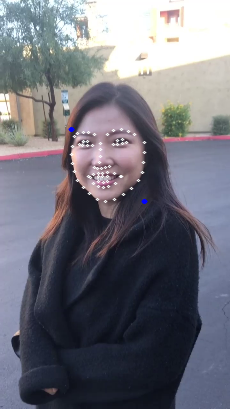

# face-recognition-opencv
This project use openCV library to find the location of eyes, nose, and lips and overlay images or emojis on human face. 
I used openCV library with python and Tensorflow.
### Input Image

### Output after detecting human face

### Final Output file

